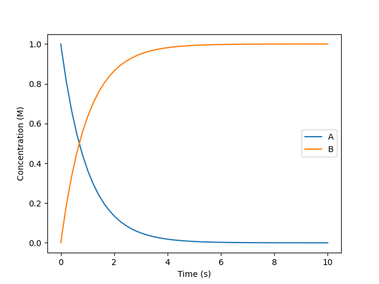

Basic usage: a simple chemical kinetics
=======================================

This first example addresses the most basic features of overreact.
We are going to simulate the following simple scheme:

.. math::

   \require{mhchem}
   \ce{A ->[k_f] B}

This reaction suggests the following set of equations:

.. math::

   \begin{align*}
     \frac{dA}{dt} &= -k_f A\\
     \frac{dB}{dt} &=  k_f A
   \end{align*}

The above model translates to the following in overreact:

>>> from overreact import core, simulate
>>> scheme = core.parse("A -> B")

(Other tutorials dwelve into the returned object, but let's forget it for now.)

:math:`k_f` is going to be set as unity (inverse seconds).

>>> kf = 1.0

overreact helps us to define the equations and solve the initial value problem.
First, let's define the system of ordinary differential equations:

>>> dydt = simulate.get_dydt(scheme, [kf])

The returned object above is a function of concentrations and time that defines a set of ordinary differential equations in time:

.. math::

   \frac{dy}{dt} = f(t, y)

We are going to simulate 10 seconds, starting with an initial concentration of 1 molar of A.

>>> t, y = simulate.get_y(dydt, y0=[1., 0.], method="Radau")

Returns are stored in `t` (points in time) and `y` (concentrations).

>>> import matplotlib.pyplot as plt
>>> plt.clf()
>>> plt.plot(t, y[0], label="A")
[...]
>>> plt.plot(t, y[1], label="B")
[...]
>>> plt.legend()
<...>
>>> plt.xlabel("Time (s)")
Text(...)
>>> plt.ylabel("Concentration (M)")
Text(...)
>>> plt.savefig("docs/_static/simple-first-order.png", transparent=True)

   Simple first order reaction over time.

We can see that the reaction went to full completion by checking the final concentrations:

>>> y[:, -1]
array([0.0000, 1.0000])
