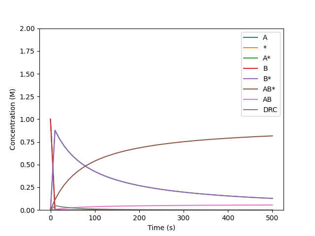

Degree of Rate Control
======================

Here we try to reproduce the analysis on the Langmuir-Hinshelwood mechanism of
<https://pubs.acs.org/doi/full/10.1021/acscatal.7b00115>.

>>> from overreact import core, thermo, rates, simulate
>>> scheme = core.parse("""
... A + % <=> A%  # fast to equilibrium
... B + % <=> B%  # fast to equilibrium
... A% + B% -> AB%* -> AB% + %  # RDS
... AB% <=> AB + %  # fast to equilibrium
... """)
>>> scheme.compounds
['A', '%', 'A%', 'B', 'B%', 'AB%*', 'AB%', 'AB']
>>> scheme.reactions
['A + % -> A%', 'A% -> A + %', 'B + % -> B%', 'B% -> B + %', 'A% + B% -> AB% + %', 'AB% -> AB + %', 'AB + % -> AB%']

where ``%`` denotes a free surface site.

>>> import numpy as np
>>> from scipy.misc import derivative
>>> from scipy.constants import kilo, calorie
>>> k = rates.eyring(kilo * calorie * thermo.get_delta_freeenergy(scheme.B, [0, 0, -2.5, 0, -2.5, 15.0, 0.0, -2.5]))
>>> k
array([4.2245e+14, 6.2124e+12, 4.2245e+14, 6.2124e+12,
       1.3588e-02, 4.2245e+14, 6.2124e+12])
>>> dydt = simulate.get_dydt(scheme, k)

Now the graph:

>>> import matplotlib.pyplot as plt
>>> y0 = [1., 1000., 0, 1., 0., 0., 0., 0.]
>>> t, y = simulate.get_y(dydt, y0, [0.0, 30 * 60.0], method="BDF")
>>> plt.clf()
>>> for i, compound in enumerate(scheme.compounds):
...    if not compound.endswith("*"):
...        plt.plot(t, y[i], label=compound)
[...]
>>> drc = [derivative(lambda k: simulate.get_dydt(scheme, k)(0.0, y)[-1], np.array(k), 1e-4) for y in y.T]
>>> plt.plot(t, drc, label="DRC")
[...]
>>> plt.legend()
<...>
>>> plt.xlabel("Time (s)")
Text(...)
>>> plt.ylim(0, 2)
(...)
>>> plt.ylabel("Concentration (M)")
Text(...)
>>> plt.savefig("docs/_static/drc.png", transparent=True)

   A one minute simulation of the Langmuir-Hinshelwood mechanism.
